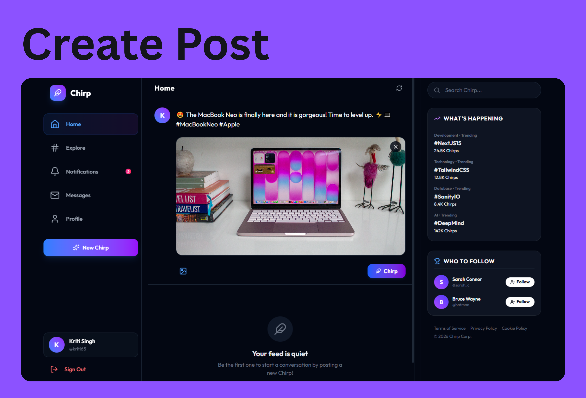

# 🐦 Chirp - A Social Media App Inspired by Twitter

Chirp is a modern, high-fidelity social media platform inspired by Twitter. It features a stunning **dark-mode glassmorphic aesthetic**, robust **JWT user authentication**, text and image post creation, interactive like and comment systems, and a fully customisable content management workflow powered by **Sanity.io**.

---

## 📸 Application Showcases

### 🔑 1. User Authentication
A seamless authentication flow featuring instant client validation feedback, password hashing (via `bcryptjs`), and secure HTTP-Only cookie-based session management. Supports switching between Login and Register states with sliding animation containers.


### ✍️ 2. Create Post
An interactive post composer that allows users to express their thoughts with real-time text input and image file attachments. Attached files are immediately rendered in an inline media preview before posting and are uploaded to the Sanity database.


### 💬 3. Interactive Likes & Comments
Dynamic engagement system allowing users to double-tap or click the heart button to toggle likes, featuring an optimistic UI update for instant feedback. The comments module handles real-time nesting of replies with user metadata.


### 📱 4. Fully Responsive Design
Carefully optimized for viewports ranging from 320px (e.g. mobile devices) up to large desktop screens. Displays a full sidebar navigation and trending panel on large screens, collapsing responsively into a bottom navigation tab bar on mobile.


### 🗄️ 5. Centralized Content Management
Includes an embedded **Sanity Studio** interface accessible at `/studio`. This provides developers and moderators with a full-fledged admin dashboard to manage, verify, and moderate users, posts, and comments in real-time.


---

## 🛠️ Tech Stack

* **Framework**: Next.js 15 (App Router, Route Protection, API Route Handlers)
* **Language**: TypeScript
* **Styling**: Tailwind CSS & Vanilla CSS (with custom Glassmorphic tokens)
* **Backend Database & CMS**: Sanity.io (using `@sanity/client` and `@sanity/image-url`)
* **Authentication**: JSON Web Tokens (JWT) + HTTP-Only Cookies + Bcrypt password hashing
* **Icons**: Lucide React

---

## 🚀 Local Development Setup

To run Chirp locally on your machine, follow these steps:

### 1. Clone and Install Dependencies
```bash
git clone https://github.com/your-username/chirp-twitter-clone.git
cd chirp-twitter-clone
npm install
```

### 2. Configure Environment Variables
Create a `.env.local` file in the root directory and add the following keys:
```env
NEXT_PUBLIC_SANITY_PROJECT_ID=your_sanity_project_id
NEXT_PUBLIC_SANITY_DATASET=production
NEXT_PUBLIC_SANITY_API_VERSION=2024-01-01
SANITY_API_WRITE_TOKEN=your_sanity_write_token_with_editor_permissions
JWT_SECRET=your_custom_secure_jwt_secret_key
```

### 3. Run the Development Server
```bash
npm run dev
```
Open [http://localhost:3000](http://localhost:3000) to view the application.

---

## ⚙️ Sanity.io Integration & CORS Setup
To support actions like liking, commenting, and posting, you need to configure access permissions in your Sanity project:
1. Visit the [Sanity Manage Dashboard](https://www.sanity.io/manage).
2. Go to **API settings** -> **CORS origins**, and click **Add CORS origin**. Add `http://localhost:3000` (check **Allow credentials**).
3. Under **API settings** -> **Tokens**, generate an API token with **Editor** permissions and add it to your `.env.local` as `SANITY_API_WRITE_TOKEN`.
